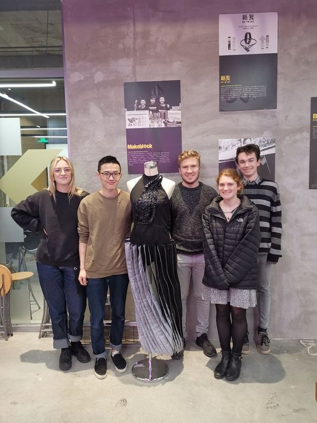

<h1 align="center">
   
  
   
    SDES - Shensuo
   
</h1>

  <a href="https://www.instructables.com/id/Shensuo/">Instructable</a> •
  <a href="#what-is-the-project">What is the project</a>

## What is the project
The project consisted of 5 students from UNSW, 4 from the faculty of arts and one (me) engineer from Computer Science. The Project was to design some form of wearable art piece that incorporated some interesting application of technology that could react with the environment.

The dress we designed changed shape and colour based on the ambient temperature, and could also be set on a schedule.

The above code is the prototype arduino code I wrote to manipulate the dress.

The project was selective and was held across Hong Kong, Shenzhen and Beijing. The final presentation was held at Woolmark in Hong Kong, and the majority of the construction was completed in Shenzhen in a maker space provided by Seeed Studios.

---
